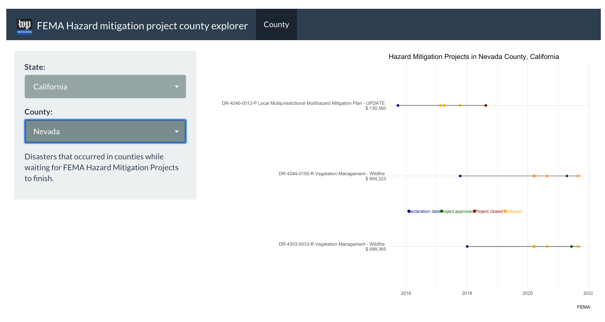

[This data is published under an [Attribution-NonCommercial-ShareAlike 4.0 International (CC BY-NC-SA 4.0) license](https://creativecommons.org/licenses/by-nc-sa/4.0/)]

# About this story

[TK TK ](https://www.washingtonpost.com/)

Summary TK

# Methodology

The Post cleaned FEMA's Hazard Mitigation Assistance Projects data and joined it with FEMA's Disaster Declarations Summaries data to determine which designated disasters occurred between three time periods 

* declared disaster date and approval date 

* approval date and closed date and 

* declared disaster date and closed date or October 1, 2021 if the project was still open.

# About the data

The data was pulled from OpenFEMA.

* [Hazard Mitigation Assistance Projects - v2*](https://www.fema.gov/openfema-data-page/hazard-mitigation-assistance-projects-v2)

* [Disaster Declarations Summaries](https://www.fema.gov/openfema-data-page/disaster-declarations-summaries-v2)

# Folders of note in this repo

* **[data/raw_data](data/raw)** - Downloaded data from the OpenFEMA

* **[scripts/import](scripts/import)** - Scripts to prepare FEMA data and exploratory analysis

* **[outputs/findings](https://github.com/wpinvestigative/fema_hazard_mitigation_2021/tree/main/outputs/findings)** - Exploratory notebook

* **[outputs/summaries](https://github.com/wpinvestigative/fema_hazard_mitigation_2021/tree/main/outputs/summaries)** - Summarized county-level data and enhanced FEMA data to join to FEMA's original projects data set

# Notebooks

* [Analysis](http://wpinvestigative.github.io/fema_hazard_mitigation_2021/outputs/findings/01_mitigation_analysis.html) - Methodology and analysis for story


# Explorer app




To run the app, you must have [R version 3.5 or later](https://cloud.r-project.org/) installed first.

**Via terminal**

After you've installed R, In the terminal, run

```
R -e "install.packages('shiny', repos='https://cran.rstudio.com/')"
R -e "shiny::runGitHub('fema_hazard_mitigation_2021', 'wpinvestigative', ref="main", launch.browser=TRUE)"
```

**Via RStudio**

The application can be run locally with the following command in [R Studio](https://www.rstudio.com/products/rstudio/download/#download): 

```
install.packages("shiny", repos="https://cran.rstudio.com/")
shiny::runGitHub("fema_hazard_mitigation_2021", "wpinvestigative", ref="main")
```

**troubleshooting**

If you have connectivity issues, you may need to preinstall some packages:

```
# run these lines in RStudio console

packages <- c("tidyverse", "shiny", "shinyWidgets", "lubridate", "shinythemes", "DT")
if (length(setdiff(packages, rownames(installed.packages()))) > 0) {
  install.packages(setdiff(packages, rownames(installed.packages())), repos = "https://cran.us.r-project.org")  
}
```
